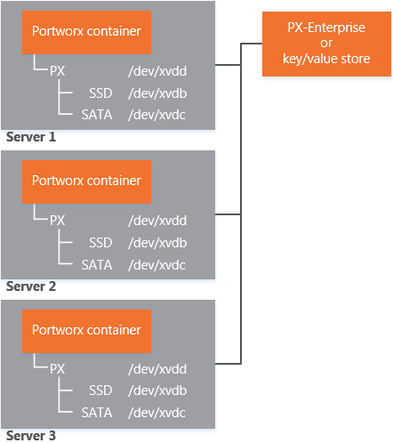
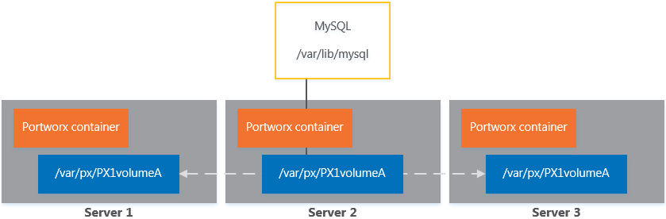

Portworx storage is deployed as a container and runs on a cluster of servers. Application containers provision storage directly through the Docker [volume plugins](https://docs.docker.com/engine/extend/plugins_volume/#command-line-changes:be52bcf493d28afffae069f235814e9f) API or the Docker [command-line](https://docs.docker.com/engine/extend/plugins_volume/#command-line-changes:be52bcf493d28afffae069f235814e9f). Administrators and DevOps can alternatively pre-provision storage through the Portworx command-line tool (**pxctl**) and then set storage policies using the PX-Enterprise web console.

Portworx storage runs in a cluster of server nodes.

Each server has the Portworx container and the Docker daemon.
Servers join a cluster and share configuration through PX-Enterprise or the key/value store, such as etcd.
The Portworx container pools the capacity of the storage media residing on the server. You easily select storage media through the [config.json](https://raw.githubusercontent.com/portworx/px-dev/master/conf/config.json) file.

Storage volumes are thinly provisioned, using capacity only as an application consumes it. Volumes are replicated across the nodes within the cluster, per a volume’s configuration, to ensure high availability.

Using MySQL as an example, a Portworx storage cluster has the following characteristics:

* MySQL is unchanged and continues to write its data to /var/lib/mysql.
* This data gets stored in the container’s volume, managed by Portworx.
* Portworx synchronously and automatically replicates writes to the volume across the cluster.

Each volume specifies its request of resources (such as its max capacity and IOPS) and its individual requirements (such as ext4 as the file system and block size).

Using IOPS as an example, a team can choose to set the MySQL container to have a higher IOPS than an offline batch processing container. Thus, a container scheduler can move containers, without losing storage and while protecting the user experience.
