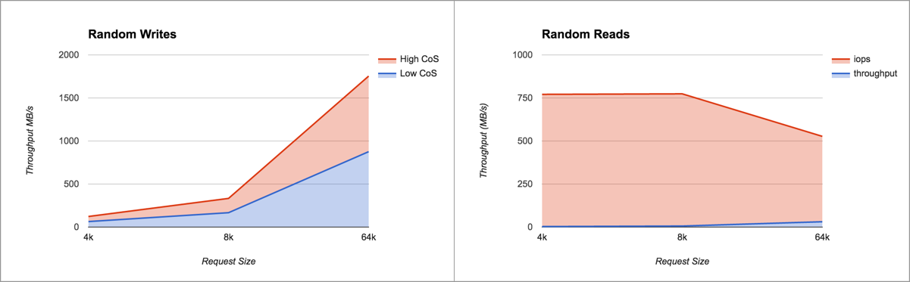

Through class of service (also known as a `CoS`), a single volume's class of service can be controlled and mapped to specific underlying storage infrastructure capabilities.

## Explanation of Class of Service

Portworx volumes can operate at different class of service. Using class of service you can tune your volume for higher 
throughput and/or IOPS. The *High* CoS is optimized for IOPS, *Medium* is optimized for throughput. 

Portworx instances have a complete matrix of available CoS levels in the entire cluster. This is dynamic and dictates data placement and movement.  In runtime, IO queues are adjusted based on desired CoS levels.

## Usage
To create a volume with a specific class of service level, use the `--cos` parameter in the volume create options.  As with other parameters, this CoS parameter can also be passed in as a label via Docker or any scheduler.

```
# /opt/pwx/bin/pxctl volume create --cos high volume-name
```

Here is an example output from [fio](https://github.com/axboe/fio) when measuring the CoS feature on an Intel server with NVMe and SATA drives.

| Random   	| Low CoS IOPS	| High CoS IOPS 	|
| 4K 	  	| 768         	| 65024				|
| 8K    	| 642         	| 46848     		|
| 64K    	| 496         	| 9824     			|

The graph below shows the sequential and random read and write performance on high and low CoS volume types:

### Random Read and Writes


### Sequential Read and Writes


## Try it out on Amazon

### Create EBS volumes AWS
Here, we create volumes of 3 different volume types in AWS.  Refer to [AWS EBS volume types](http://docs.aws.amazon.com/AWSEC2/latest/UserGuide/EBSVolumeTypes.html) for more information on the EBS volume capabilities.  PWX will automatically detect the volume type and classify it into the correct service category.

* Create one 500GB HDD volume
* Create one 100GB standard volume
* Create one 1000GB IO optimized volume


Here is what you should see when you list your block devices:

```
# lsblk
NAME                                                    MAJ:MIN RM  SIZE RO TYPE MOUNTPOINT
xvda                                                    202:0    0   64G  0 disk
└─xvda1                                                 202:1    0   64G  0 part /
xvdj                                                    202:144  0  128G  0 disk
xvdl                                                    202:176  0  500G  0 disk
xvdn                                                    202:208  0  999G  0 disk
```

Create a `config.json` with the following drives in it... we will add the fourth standard ebs volume later

```
# cat /etc/pwx/config.json
{
    "alertingurl": "",
    "clusterid": "cos-demo-cluster",
    "dataiface": "",
    "kvdb": [
    	"etcd://localhost:4001"
    ],
    "mgtiface": "",
    "storage": {
        "devices": [
            "/dev/xvdl",
            "/dev/xvdn",
            "/dev/xvdj"
        ]
    }
}
```

```
# pxctl status
Status: PX is operational
Node ID: 5f794df0-b337-42d7-afc0-440c19fc4b0e
        IP: 172.31.2.134
        Local Storage Pool: 3 pools
        Pool    Cos             Size    Used    Status  Zone    Region
        0       COS_TYPE_LOW    500 GiB 1.1 GiB Online  a       us-west-1
        1       COS_TYPE_HIGH   999 GiB 1.1 GiB Online  a       us-west-1
        2       COS_TYPE_MEDIUM 128 GiB 1.1 GiB Online  a       us-west-1
        Local Storage Devices: 3 devices
        Device  Path            Media Type              Size            Last-Scan
        0:1     /dev/xvdl       STORAGE_MEDIUM_SSD      500 GiB         14 Nov 16 02:01 UTC
        1:1     /dev/xvdn       STORAGE_MEDIUM_SSD      991 GiB         14 Nov 16 02:01 UTC
        2:1     /dev/xvdj       STORAGE_MEDIUM_SSD      128 GiB         14 Nov 16 02:01 UTC
        total                   -                       1.6 TiB
Cluster Summary
        Cluster ID: ohyeah0014
        Node IP: 172.31.2.134 - Capacity: 3.2 GiB/1.6 TiB Online (This node)
Global Storage Pool
        Total Used      :  3.2 GiB
        Total Capacity  :  1.6 TiB
```

The `status` command on any node shows the pools with different classes of services listed.  The format `x:y` in the Device column indicates the `pool:device` participating in that pool.


### Inspect different pools

```
# /opt/pwx/bin/pxctl service drives
PX drive configuration:
Pool ID: 0
	Cos: COS_TYPE_LOW
	Size: 500 GiB
	Status: Online
	Has meta data: No
	Drives:
	1: /dev/xvdl, 4.1 GiB allocated of 500 GiB, Online
Pool ID: 1
	Cos: COS_TYPE_HIGH
	Size: 991 GiB
	Status: Online
	Has meta data: No
	Drives:
	1: /dev/xvdn, 2.1 GiB allocated of 991 GiB, Online
Pool ID: 2
	Cos: COS_TYPE_MEDIUM
	Size: 128 GiB
	Status: Online
	Has meta data: Yes
	Drives:
	1: /dev/xvdj, 2.1 GiB allocated of 128 GiB, Online
```

### Measure Performance
Let's first create three volumes with a high, medium and low class of service:

```
# /opt/pwx/bin/pxctl volume create --cos high test-high --size 8
test-high
# /opt/pwx/bin/pxctl volume create --cos med test-med --size 8
test-med
# /opt/pwx/bin/pxctl volume create --cos low test-low --size 8
test-low
```

Now we use [fio](https://github.com/axboe/fio) to measure PX volume performance on each of these volumes. 
Note that backend disk performance while performance tests are running can be visualized with iostat

```
# iostat -xm 1

Device:         rrqm/s   wrqm/s     r/s     w/s    rMB/s    wMB/s avgrq-sz avgqu-sz   await r_await w_await  svctm  %util
xvdj             30.00   114.00  660.00  380.00    10.61    43.66   106.87    48.63   93.53    1.30  253.71   0.67  70.00
xvdl              0.00     0.00    0.00    0.00     0.00     0.00     0.00     0.00    0.00    0.00    0.00   0.00   0.00
xvdn              0.00     0.00    0.00    0.00     0.00     0.00     0.00     0.00    0.00    0.00    0.00   0.00   0.00
```

#### Test a high CoS volume on EBS

```
# docker run --rm --volume-driver=pxd -v test-high:/test      \
gourao/fio /usr/bin/fio --blocksize=16k -directory=/test       \
--filename=test --ioengine=libaio --readwrite=randrw          \
--size=1G --name=test --verify=meta --do_verify=1             \
--verify_pattern=0xDeadBeef --direct=1 --gtod_reduce=1        \
--iodepth=128 --randrepeat=1  --end_fsync=1
```

Results:

```
test: (g=0): rw=randrw, bs=16K-16K/16K-16K/16K-16K, ioengine=libaio, iodepth=128
fio-2.1.11
Starting 1 process

test: (groupid=0, jobs=1): err= 0: pid=6: Mon Nov 14 07:56:33 2016
  read : io=524880KB, bw=48772KB/s, iops=3048, runt= 10762msec
  write: io=523696KB, bw=48662KB/s, iops=3041, runt= 10762msec
  cpu          : usr=1.28%, sys=6.92%, ctx=7987, majf=0, minf=6
  IO depths    : 1=0.1%, 2=0.1%, 4=0.1%, 8=0.1%, 16=0.1%, 32=0.1%, >=64=99.9%
     submit    : 0=0.0%, 4=100.0%, 8=0.0%, 16=0.0%, 32=0.0%, 64=0.0%, >=64=0.0%
     complete  : 0=0.0%, 4=100.0%, 8=0.0%, 16=0.0%, 32=0.0%, 64=0.0%, >=64=0.1%
     issued    : total=r=32805/w=32731/d=0, short=r=0/w=0/d=0
     latency   : target=0, window=0, percentile=100.00%, depth=128

Run status group 0 (all jobs):
   READ: io=524880KB, aggrb=48771KB/s, minb=48771KB/s, maxb=48771KB/s, mint=10762msec, maxt=10762msec
  WRITE: io=523696KB, aggrb=48661KB/s, minb=48661KB/s, maxb=48661KB/s, mint=10762msec, maxt=10762msec

Disk stats (read/write):
  pxd!pxd140712484780077737: ios=33003/32734, merge=0/2, ticks=222805/226336, in_queue=449230, util=98.87%
```

#### Test a medium CoS volume on EBS

```
# docker run --rm --volume-driver=pxd -v test-med:/test      \
gourao/fio /usr/bin/fio --blocksize=16k -directory=/test       \
--filename=test --ioengine=libaio --readwrite=randrw          \
--size=1G --name=test --direct=1 --gtod_reduce=1        \
--iodepth=128 --randrepeat=1  --end_fsync=1
```

Results:

```
test: (g=0): rw=randrw, bs=16K-16K/16K-16K/16K-16K, ioengine=libaio, iodepth=128
fio-2.1.11
Starting 1 process

test: (groupid=0, jobs=1): err= 0: pid=6: Mon Nov 14 07:57:08 2016
  read : io=524880KB, bw=42363KB/s, iops=2647, runt= 12390msec
  write: io=523696KB, bw=42268KB/s, iops=2641, runt= 12390msec
  cpu          : usr=1.25%, sys=7.67%, ctx=10840, majf=0, minf=6
  IO depths    : 1=0.1%, 2=0.1%, 4=0.1%, 8=0.1%, 16=0.1%, 32=0.1%, >=64=99.9%
     submit    : 0=0.0%, 4=100.0%, 8=0.0%, 16=0.0%, 32=0.0%, 64=0.0%, >=64=0.0%
     complete  : 0=0.0%, 4=100.0%, 8=0.0%, 16=0.0%, 32=0.0%, 64=0.0%, >=64=0.1%
     issued    : total=r=32805/w=32731/d=0, short=r=0/w=0/d=0
     latency   : target=0, window=0, percentile=100.00%, depth=128

Run status group 0 (all jobs):
   READ: io=524880KB, aggrb=42363KB/s, minb=42363KB/s, maxb=42363KB/s, mint=12390msec, maxt=12390msec
  WRITE: io=523696KB, aggrb=42267KB/s, minb=42267KB/s, maxb=42267KB/s, mint=12390msec, maxt=12390msec

Disk stats (read/write):
  pxd!pxd1076009269408190983: ios=33394/32741, merge=0/4, ticks=474477/441750, in_queue=916431, util=98.94%
```

#### Test a low CoS volume on EBS

```
# docker run --rm --volume-driver=pxd -v test-low:/test      \
gourao/fio /usr/bin/fio --blocksize=16k -directory=/test       \
--filename=test --ioengine=libaio --readwrite=randrw          \
--size=1G --name=test --direct=1 --gtod_reduce=1        \
--iodepth=128 --randrepeat=1  --end_fsync=1
```

Results:

```
test: (g=0): rw=randwrite, bs=64K-64K/64K-64K/64K-64K, ioengine=libaio, iodepth=64
fio-2.1.11
Starting 1 process
test: (g=0): rw=randrw, bs=16K-16K/16K-16K/16K-16K, ioengine=libaio, iodepth=128
fio-2.1.11
Starting 1 process

test: (groupid=0, jobs=1): err= 0: pid=6: Mon Nov 14 07:59:30 2016
  read : io=524880KB, bw=4304.9KB/s, iops=269, runt=121928msec
  write: io=523696KB, bw=4295.2KB/s, iops=268, runt=121928msec
  cpu          : usr=0.19%, sys=0.88%, ctx=22021, majf=0, minf=6
  IO depths    : 1=0.1%, 2=0.1%, 4=0.1%, 8=0.1%, 16=0.1%, 32=0.1%, >=64=99.9%
     submit    : 0=0.0%, 4=100.0%, 8=0.0%, 16=0.0%, 32=0.0%, 64=0.0%, >=64=0.0%
     complete  : 0=0.0%, 4=100.0%, 8=0.0%, 16=0.0%, 32=0.0%, 64=0.0%, >=64=0.1%
     issued    : total=r=32805/w=32731/d=0, short=r=0/w=0/d=0
     latency   : target=0, window=0, percentile=100.00%, depth=128

Run status group 0 (all jobs):
   READ: io=524880KB, aggrb=4304KB/s, minb=4304KB/s, maxb=4304KB/s, mint=121928msec, maxt=121928msec
  WRITE: io=523696KB, aggrb=4295KB/s, minb=4295KB/s, maxb=4295KB/s, mint=121928msec, maxt=121928msec

Disk stats (read/write):
  pxd!pxd597887972375262430: ios=33477/32778, merge=0/22, ticks=7431768/6880651, in_queue=14312709, util=99.96%
```

### Summary of AWS Results

| CoS    	| Random Write 	| Random Read 	| Read IOPS 	| Write IOPS 	|
| High   	| 48 MB/S 	    | 48 MB/S		| 3048			| 3041       	|
| Medium 	| 42 MB/S   	| 42 MB/S		| 2647       	| 2641       	|
| Low    	| 4.3 MB/s		| 4.3 MB/s		| 269			| 268       	|
