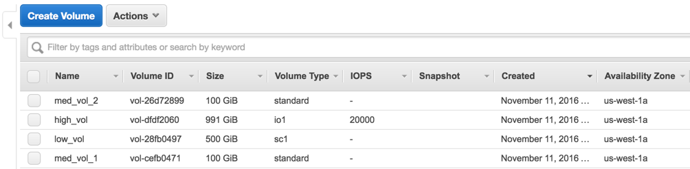

Through class of service (also known as a `CoS`), a single volume's class of service can be controlled and mapped to specific underlying storage infrastructure capabilities.

## Explanation of Class of Service
XXX

## Try it out

### Create 3 different class of service volumes in AWS
Here, we create four volumes of 3 different volume types in AWS.  Refer to [AWS EBS volume types](http://docs.aws.amazon.com/AWSEC2/latest/UserGuide/EBSVolumeTypes.html) for more information on the EBS volume capabilities.  PWX will automatically detect the volume type and classify it into the correct service category.

* Create one 500GB HDD volume
* Create one 100GB standard volume
* Create one 1000GB IO optimized volume



Here is what you should see when you list your block devices:

```
# lsblk
NAME                                                    MAJ:MIN RM  SIZE RO TYPE MOUNTPOINT
xvda                                                    202:0    0   64G  0 disk
└─xvda1                                                 202:1    0   64G  0 part /
xvdj                                                    202:144  0  128G  0 disk
xvdl                                                    202:176  0  500G  0 disk
xvdn                                                    202:208  0  999G  0 disk
```

Create a `config.json` with the following drives in it... we will add the fourth standard ebs volume later

```
# cat /etc/pwx/config.json
{
    "alertingurl": "",
    "clusterid": "cos-demo-cluster",
    "dataiface": "",
    "kvdb": [
    	"etcd://localhost:4001"
    ],
    "mgtiface": "",
    "storage": {
        "devices": [
            "/dev/xvdl",
            "/dev/xvdn",
            "/dev/xvdj"
        ]
    }
}
```

```
# pxctl status
Status: PX is operational
Node ID: 5f794df0-b337-42d7-afc0-440c19fc4b0e
        IP: 172.31.2.134
        Local Storage Pool: 3 pools
        Pool    Cos             Size    Used    Status  Zone    Region
        0       COS_TYPE_LOW    500 GiB 1.1 GiB Online  a       us-west-1
        1       COS_TYPE_HIGH   999 GiB 1.1 GiB Online  a       us-west-1
        2       COS_TYPE_MEDIUM 128 GiB 1.1 GiB Online  a       us-west-1
        Local Storage Devices: 3 devices
        Device  Path            Media Type              Size            Last-Scan
        0:1     /dev/xvdl       STORAGE_MEDIUM_SSD      500 GiB         14 Nov 16 02:01 UTC
        1:1     /dev/xvdn       STORAGE_MEDIUM_SSD      991 GiB         14 Nov 16 02:01 UTC
        2:1     /dev/xvdj       STORAGE_MEDIUM_SSD      128 GiB         14 Nov 16 02:01 UTC
        total                   -                       1.6 TiB
Cluster Summary
        Cluster ID: ohyeah0014
        Node IP: 172.31.2.134 - Capacity: 3.2 GiB/1.6 TiB Online (This node)
Global Storage Pool
        Total Used      :  3.2 GiB
        Total Capacity  :  1.6 TiB
```

The `status` command on any node shows the pools with different classes of services listed.  The format `x:y` in the Device column indicates the `pool:device` participating in that pool.

Note the "SHARED" status of the volume, in the above output.


### Measure Performance
Let's first create three volumes with a high, medium and low class of service:

```
# /opt/pwx/bin/pxctl v c --cos high test-high
test-high
# /opt/pwx/bin/pxctl v c --cos med test-med
test-med
# /opt/pwx/bin/pxctl v c --cos low test-low
test-low
```

Now we use [fio](https://github.com/axboe/fio) to measure PX volume performance on each of these volumes

Test a high CoS volume on EBS

```
# docker run --rm --volume-driver=pxd -v test-high:/test        \
    gourao/fio /usr/bin/fio --blocksize=64k --directory=/test   \
    --filename=test --ioengine=libaio --readwrite=randwrite     \
    --size=500M --name=test --verify=meta --do_verify=1 		\
	--verify_pattern=0xDeadBeef --direct=1 --gtod_reduce=1 i    \
    --iodepth=64 --randrepeat=1
```

Results:

```
test: (g=0): rw=randwrite, bs=64K-64K/64K-64K/64K-64K, ioengine=libaio, iodepth=64
fio-2.1.11
Starting 1 process

test: (groupid=0, jobs=1): err= 0: pid=6: Mon Nov 14 03:46:53 2016
  read : io=512000KB, bw=888889KB/s, iops=13888, runt=   576msec
  write: io=512000KB, bw=506931KB/s, iops=7920, runt=  1010msec
  cpu          : usr=7.82%, sys=17.85%, ctx=3928, majf=0, minf=195
  IO depths    : 1=0.1%, 2=0.1%, 4=0.1%, 8=0.1%, 16=0.2%, 32=0.4%, >=64=99.2%
     submit    : 0=0.0%, 4=100.0%, 8=0.0%, 16=0.0%, 32=0.0%, 64=0.0%, >=64=0.0%
     complete  : 0=0.0%, 4=100.0%, 8=0.0%, 16=0.0%, 32=0.0%, 64=0.1%, >=64=0.0%
     issued    : total=r=8000/w=8000/d=0, short=r=0/w=0/d=0
     latency   : target=0, window=0, percentile=100.00%, depth=64

Run status group 0 (all jobs):
   READ: io=512000KB, aggrb=888888KB/s, minb=888888KB/s, maxb=888888KB/s, mint=576msec, maxt=576msec
  WRITE: io=512000KB, aggrb=506930KB/s, minb=506930KB/s, maxb=506930KB/s, mint=1010msec, maxt=1010msec

Disk stats (read/write):
  pxd!pxd481766400193330855: ios=5486/8000, merge=0/0, ticks=19664/46332, in_queue=66066, util=93.32%
```

Test a medium CoS volume on EBS

```
# docker run --rm --volume-driver=pxd -v test-med:/test         \
    gourao/fio /usr/bin/fio --blocksize=64k --directory=/test   \
    --filename=test --ioengine=libaio --readwrite=randwrite     \
    --size=500M --name=test --verify=meta --do_verify=1 		\
	--verify_pattern=0xDeadBeef --direct=1 --gtod_reduce=1 i    \
    --iodepth=64 --randrepeat=1
```

Results:

```
test: (g=0): rw=randwrite, bs=64K-64K/64K-64K/64K-64K, ioengine=libaio, iodepth=64
fio-2.1.11
Starting 1 process
test: Laying out IO file(s) (1 file(s) / 500MB)

test: (groupid=0, jobs=1): err= 0: pid=6: Mon Nov 14 03:48:48 2016
  read : io=512000KB, bw=38343KB/s, iops=599, runt= 13353msec
  write: io=512000KB, bw=462511KB/s, iops=7226, runt=  1107msec
  cpu          : usr=1.20%, sys=1.89%, ctx=3394, majf=0, minf=195
  IO depths    : 1=0.1%, 2=0.1%, 4=0.1%, 8=0.1%, 16=0.2%, 32=0.4%, >=64=99.2%
     submit    : 0=0.0%, 4=100.0%, 8=0.0%, 16=0.0%, 32=0.0%, 64=0.0%, >=64=0.0%
     complete  : 0=0.0%, 4=100.0%, 8=0.0%, 16=0.0%, 32=0.0%, 64=0.1%, >=64=0.0%
     issued    : total=r=8000/w=8000/d=0, short=r=0/w=0/d=0
     latency   : target=0, window=0, percentile=100.00%, depth=64

Run status group 0 (all jobs):
   READ: io=512000KB, aggrb=38343KB/s, minb=38343KB/s, maxb=38343KB/s, mint=13353msec, maxt=13353msec
  WRITE: io=512000KB, aggrb=462511KB/s, minb=462511KB/s, maxb=462511KB/s, mint=1107msec, maxt=1107msec

Disk stats (read/write):
  pxd!pxd96377810411942024: ios=7267/8009, merge=0/34, ticks=844306/73839, in_queue=918328, util=99.39%
```

Test a low CoS volume on EBS

```
# docker run --rm --volume-driver=pxd -v test-low:/test         \
    gourao/fio /usr/bin/fio --blocksize=64k --directory=/test   \
    --filename=test --ioengine=libaio --readwrite=randwrite     \
    --size=500M --name=test --verify=meta --do_verify=1 		\
	--verify_pattern=0xDeadBeef --direct=1 --gtod_reduce=1 i    \
    --iodepth=64 --randrepeat=1
```

Results:

```
test: (g=0): rw=randwrite, bs=64K-64K/64K-64K/64K-64K, ioengine=libaio, iodepth=64
fio-2.1.11
Starting 1 process
test: Laying out IO file(s) (1 file(s) / 500MB)

test: (groupid=0, jobs=1): err= 0: pid=6: Mon Nov 14 03:53:49 2016
  read : io=512000KB, bw=875214KB/s, iops=13675, runt=   585msec
  write: io=512000KB, bw=457961KB/s, iops=7155, runt=  1118msec
  cpu          : usr=8.23%, sys=19.17%, ctx=3999, majf=0, minf=194
  IO depths    : 1=0.1%, 2=0.1%, 4=0.1%, 8=0.1%, 16=0.2%, 32=0.4%, >=64=99.2%
     submit    : 0=0.0%, 4=100.0%, 8=0.0%, 16=0.0%, 32=0.0%, 64=0.0%, >=64=0.0%
     complete  : 0=0.0%, 4=100.0%, 8=0.0%, 16=0.0%, 32=0.0%, 64=0.1%, >=64=0.0%
     issued    : total=r=8000/w=8000/d=0, short=r=0/w=0/d=0
     latency   : target=0, window=0, percentile=100.00%, depth=64

Run status group 0 (all jobs):
   READ: io=512000KB, aggrb=875213KB/s, minb=875213KB/s, maxb=875213KB/s, mint=585msec, maxt=585msec
  WRITE: io=512000KB, aggrb=457960KB/s, minb=457960KB/s, maxb=457960KB/s, mint=1118msec, maxt=1118msec

Disk stats (read/write):
  pxd!pxd772770186889012128: ios=7265/8000, merge=0/0, ticks=28338/52574, in_queue=80975, util=94.15%
```
