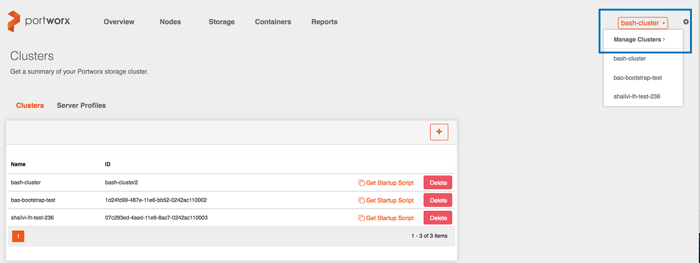
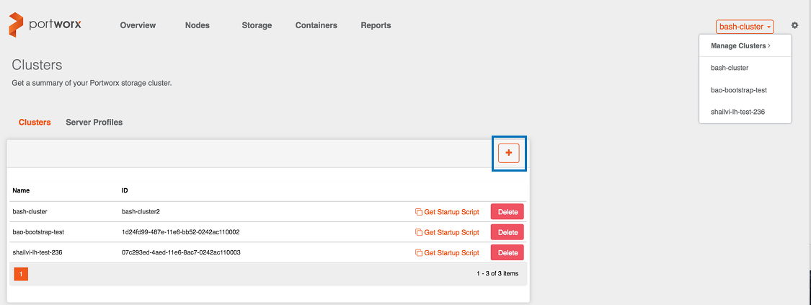
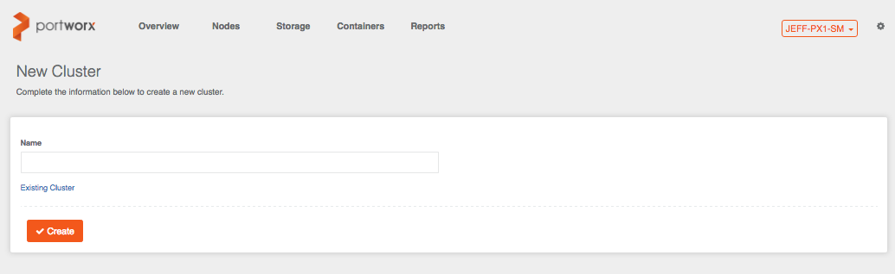
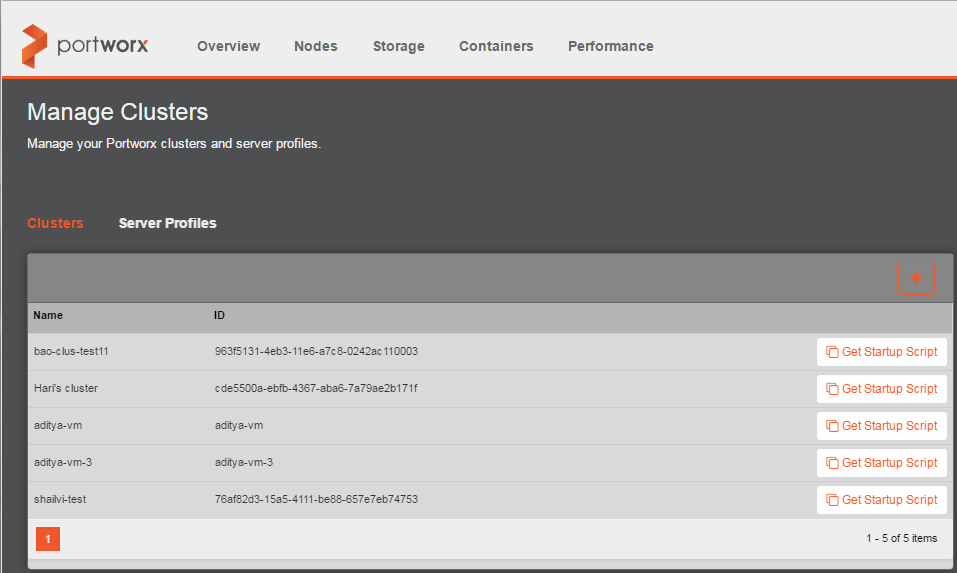
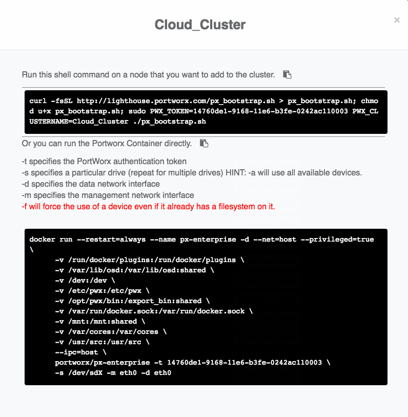
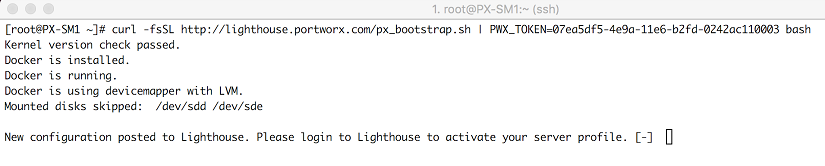
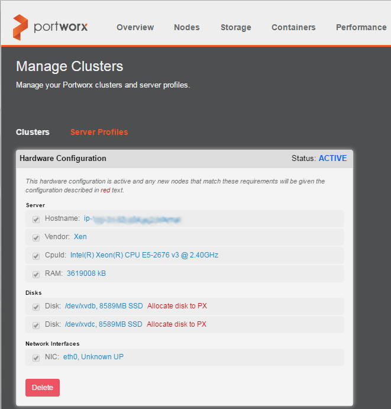
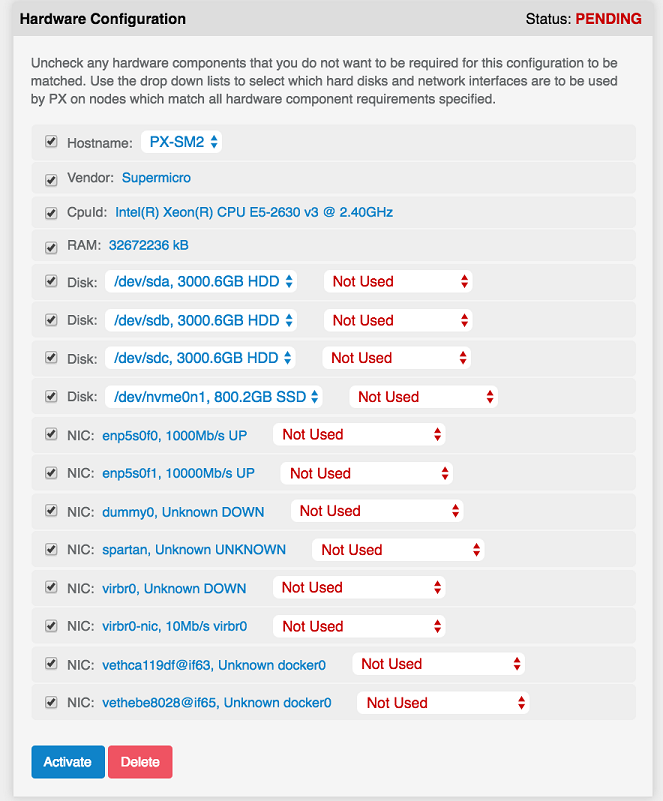
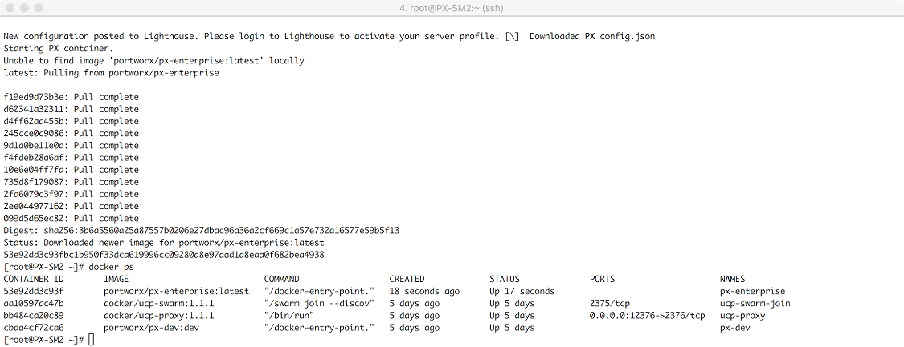

PX-Enterprise is a multi-cluster storage system that provides and manages storage for containerized workloads which run on-premises and in public clouds.

This section walks through installing and configuring a PX-Enterprise cluster. In this example, you run the PX-Enterprise Docker container on server nodes. Running the container enables PX-Enterprise to aggregate storage capacity and monitor hardware for degradation and failure. Server nodes are joined into a cluster for the sake of high availability. You can use direct attached disks, storage arrays, or cloud volumes for the underlying storage.

## Step 1: Provision a cluster in the PX-Enterprise console

Log in to the PX-Enterprise console. If a cluster has not already been created for your account, click the **Manage Clusters** menu and then click **Manage Clusters**.

On the **Clusters** page, click the **+** icon to create a new storage cluster.

Then, type a unique Name for your PX-Enterprise cluster and click **Create**.

(Don't use the "Existing Cluster" option, unless directed by Portworx Support.)

The new cluster appears in the Clusters list.

## Step 2: Run discovery and bootstrap on a server node

You will now add your first server node to the storage cluster. On the **Clusters** page, click **Get Startup Script** for the cluster you just created.

A window containing a `curl` command opens. The following `curl` example includes an authentication token and downloads the PX-Enterprise Docker container.

Log in to each node that will install PX-Enterprise and join the cluster. Open a terminal window and run as `root` or `sudo su` to give privileges. On your system, copy the `curl` string provided by the pop-up window and paste it into a terminal session and press Enter, as shown below.

## Step 3: Configure the Server Profile

The bootstrap startup script sends the server/node configuration to the PX-Enterprise web console. To view the discovered hardware configuration, click **Server Profiles** on the Manage Clusters page.

If the hardware configuration is new, you can specify which storage and network elements you want to participate in PX-Enterprise.

There are 2 important aspects of Server Profile configuration:

*  **Used elements** (dropdowns) 
*  **Elements required for a "match" rule** (checkboxes) 

**Used elements** refers to which storage and network elements on the server will be used by PX-Enterprise. You have the option of including or excluding any storage or network element from your server through the corresponding dropdown list. For example, this provides the ability to contribute certain storage elements into the aggregated Portworx Fabric, and to reserve certain storage elements for use only by the local server. PX-Enterprise will use only the storage and network elements that are provided through this Server Profile definition

**Elements required for a "match" rule** refers to Server Profile matching, which you can easily use to add nodes to a cluster. For any node running a bootstrap/discovery script, if that node's Server Profile (CPU, Memory, Storage, Network, and so on...) matches an existing Server Profile in the PX-Enterprise console, then that node gets automatically added into the appropriate cluster.

>**Note:** If there are subtle differences between the incoming node and an existing Server Profile, then a new Server Profile gets created and it must be "Activated" in the console before that node can participate in the cluster.

The following example of the Hardware Configuration page shows the discovered attributes, including hostname, server vendor, CPU, RAM, storage devices, and network devices. The Hardware Configuration rule performs the following:

* **Storage**: Aggregates storage based on the disks you select by toggling the drop-down list from **Not Used** to **Used**.

* **Network**: Specifies the interfaces PX-Enterprise should use for management and the data path. Set by toggling the drop-down list for either **Management** or **Data**.

* **Match Criteria** (checkbox): Ensures that this element is required of all servers attempting to join the cluster

Only servers matching all criteria will install PX-Enterprise. In the example above, only servers with the same Vendor, CPU ID, selected disks, and selected NICs will join the cluster.

>**Important:** As part of aggregation, PX-Enterprise overwrites any pre-existing data on the underlying storage. Preserve any data that you want to keep.  

### General vs. specific Server Profiles

For storage disks, you can match based on wildcards. For example:

* Storage of any size and any type (SSD, HDD, or other): 
`/dev/sdc *  *`

* Storage must have a specified size: 
`/dev/sdc 300GB *`

* Storage must have a specified size and type: 
`/dev/sdc 300GB SSD`

Consider carefully the implications of making a Server Profile more general or more specific. For a new server node to be automatically accepted into the PX-Enterprise cluster, the server must match an activated Server Profile.

* When a Server Profile is more **general** (the Hardware Configuration page has fewer check boxes selected), new nodes can more easily join a cluster because they are activated without your intervention

* When a Server Profiles is more **specific**, such as matched on hostnames, you must specifically activate those Server Profiles before servers can join a cluster.

>**Important:** Portworx recommends implementing **specific** matching policies versus **general** policies.   Strict policies will tend to enforce stronger deterministic and predictable behavior.

PX-Enterprise aggregates and monitors for health only the disks marked with **Allocated to PX**.

## Step 4: Select network interfaces and activate

PX-Enterprise assigns the selected NICs to the management interface, the data interface, or both. PX-Enterprise requires at least one NIC and only needs a maximum of two NICs.

The *management interface* is used for communication between the hosted PX-Enterprise product and the individual server nodes, for control-path as well as statistics and metrics. The *data interface* is used between server nodes, primarily for data transfer as part of data availability (that is, multi-node data replication).

To instruct the PX-Enterprise container on the server node to complete the installation, click **Activate** on the Hardware Configuration page. Upon installation, PX-Enterprise aggregates the specified storage and uses the network interfaces selected.

From the server node that ran the `curl` command, you should see the following status:

## Step 5: Expand the cluster

You can add new servers nodes to the existing cluster by running the bootstrap script for a cluster. Server nodes can have different Server Profiles, where some servers might contribute little or no storage to the cluster.

>**Important:** For server node connections, use a low-latency network, as opposed to spanning a WAN. For more details, see [Step 1: Verify requirements](get-started-px-developer.html#step-1-verify-requirements).

For a new server node to be automatically accepted into the PX-Enterprise cluster, the server must match an activated Server Profile.
