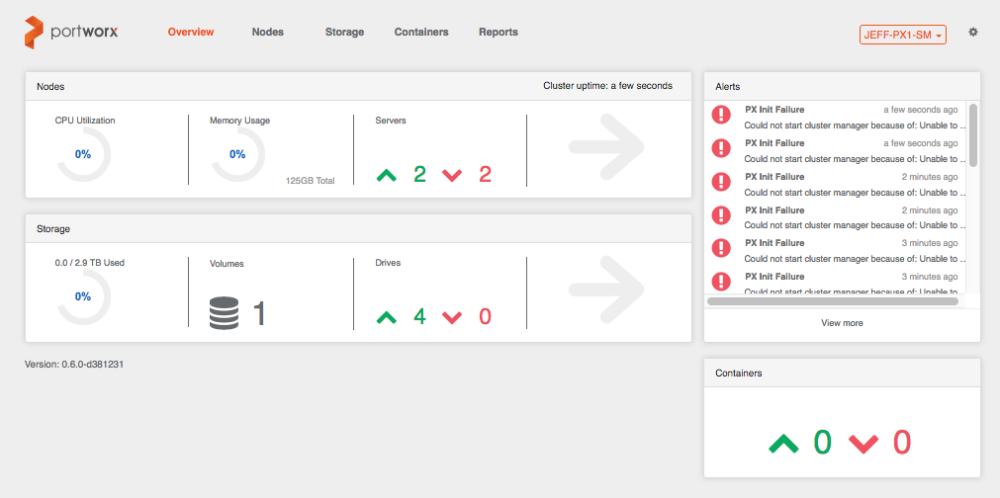

Portworx PX-Enterprise is full-featured container storage for DevOps, IT ops, and the enterprise.

## Step 1: Verify requirements

* Linux kernel 3.10 or greater
* Docker 1.10 or greater, configured with [devicemapper](https://docs.docker.com/engine/userguide/storagedriver/device-mapper-driver/#/configure-docker-with-devicemapper)
* Configure Docker to use shared mounts.  The shared mounts configuration is required, as PX-Enterprise exports mount points.
  * Run sudo mount --make-shared / in your SSH window
  * If you are using systemd, remove the `MountFlags=slave` line in your docker.service file.
* Minimum resources per server:
  * 4 CPU cores
  * 4 GB RAM
* Recommended resources per server:
  * 12 CPU cores
  * 16 GB RAM
  * 128 GB storage
  * 10 GB Ethernet NIC
* Maximum nodes per cluster:
    * 20 server nodes
* Open network ports:
  * Ports 9000 - 9005 must be open for internal network traffic between nodes running PX

## Step 2: Get PX-Enterprise

For information about PX-Enterprise and to request a demo, please provide your contact information [here](http://na-sj15.marketo.com/lp/126-NHQ-240/request_a_demo.html).

After you purchase PX-Enterprise, you'll receive an email with the PX-Enterprise web console URL.

## Step 3: Take a tour of the PX-Enterprise web console

The PX-Enterprise web console provides storage management for all of your PX-Enterprise deployments, including on-premises clusters and in public clouds. The console monitors health and capacity and lets you provide container-granular storage. You can use any scheduler to orchestrate containers.

The Overview page provides a summary view of the health of a cluster. You select a cluster from the upper-right dropdown list. The Alerts identify important status changes for the selected cluster, sorted by recency of the error or warning.

Use the menu bar to navigate to server Nodes, manage Storage, view Containers, or chart the performance and storage capacity for a cluster.

The Storage page presents a complete view for a cluster’s storage, as shown below. From this page, you can create new volumes (under Actions) and manage existing volumes, including snapshotting a volume.

You can also create volumes programmatically using a scheduler or by the container itself, as well as from the command-line. You can manage a volume created by any of those methods from the Storage page. For information about supported schedulers, see "Run PX-Enterprise with schedulers" in the next step.

For more on creating and managing volumes, see [Create and Manage Storage Volumes](create-manage-storage-volumes.html).

## Step 4: Start configuring

[Create a PX-Enterprise Cluster](create-px-enterprise-cluster.html)   
[Create and Manage Storage Volumes](create-manage-storage-volumes.html)   
[Manage Users](manage-users-groups.html)

Run Portworx with schedulers:

* [Run Portworx with Kubernetes](run-with-k8s.html)
* [Run Portworx with Mesosphere](run-with-mesosphere.html)
* [Run Portworx with Rancher](run-with-rancher.html)

Use **pxctl** ([CLI Reference](cli-reference.html)) to directly:

* View the cluster global capacity and health
* Create, inspect, and delete storage volumes
* Attach policies for IOPs prioritization, maximum volume size, and enable storage replication
