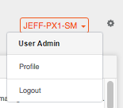
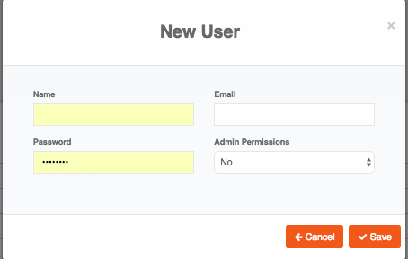

# Manage Users

To create users, click the gear icon in the upper-right corner of the console and choose **User Admin**.

Click the **New User** button, fill in the user details, and click **Save**. Giving a user Admin permissions provides the user greater visibility across all clusters as well as the ability to create additional users.

