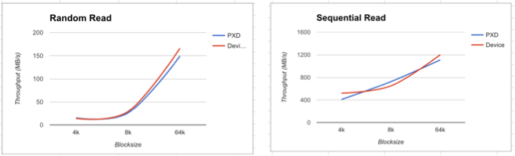
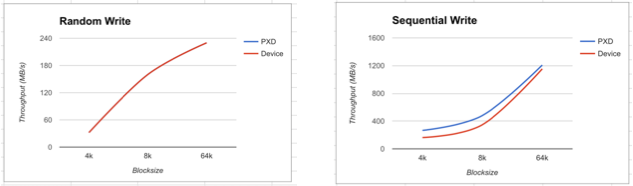
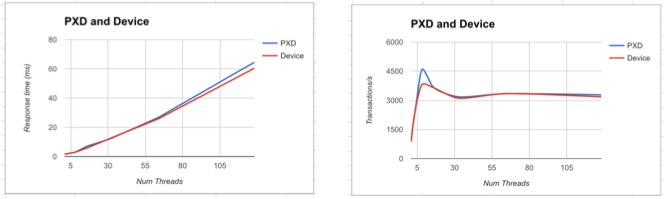
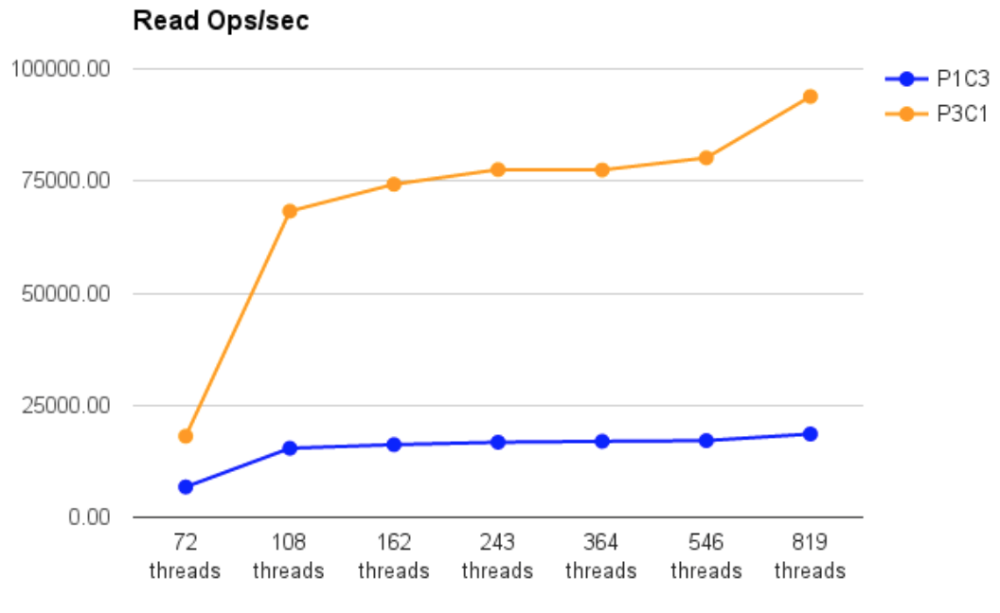
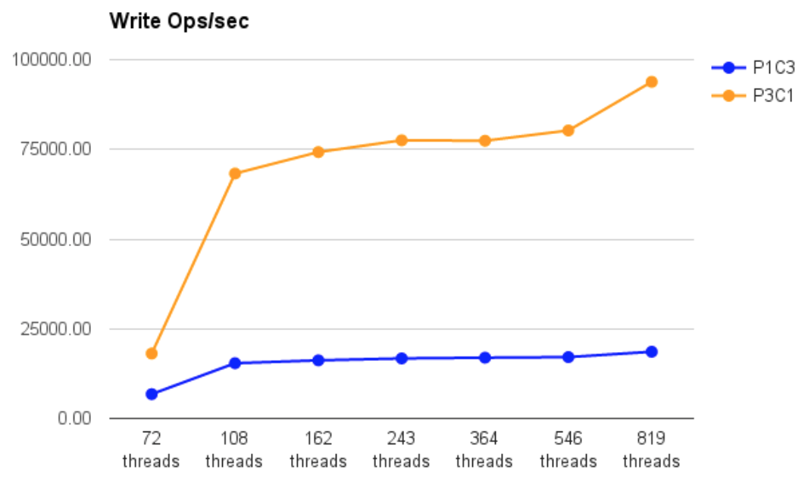
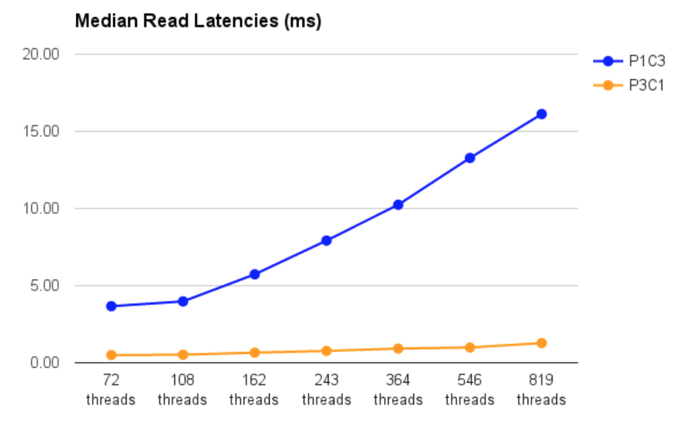
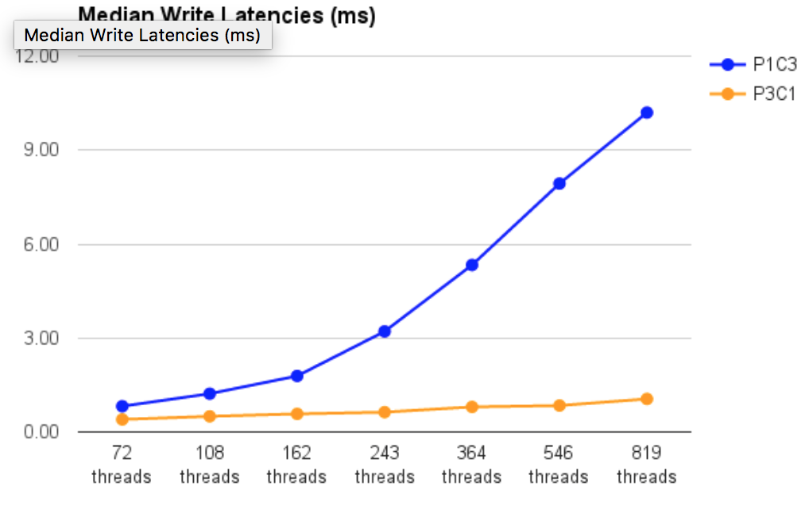

Portworx operates typically within less than 3% overhead of the underlying storage hardware.

Note that Portworx recommends the following:

* Minimum resources per server:
  * 4 CPU cores
  * 4 GB RAM
* Recommended resources per server:
  * 12 CPU cores
  * 16 GB RAM
  * 128 GB Storage
  * 10 GB Ethernet NIC

## Examples of Portworx performance as measured by [fio](https://github.com/axboe/fio)

The following graphs show the results of running fio against the underlying baremetal hardware and comparing it to the performance of a Portworx volume that used the underlying hardware for storage provisioning.  The graphs show the overhead, or delta, between running the same test on the raw volume and on a PX volume.

In this example, the following Intel server was used:
Intel® Wildcat Pass R2312WTTYS 2U
from PCSD - Product Collaboration Systems Division

* Intel® Wildcat Pass R2312WTTYS 2U
  * 2U rack mountable server
  * 2x Intel® Xeon® processors E5-2650 v3 (25M Cache, 2.30 GHz)
  * 500GB SATA 6Gb/s 7200 RPM 2.5" hard drive
  * 120GB Intel® DC S3500 series (Wolfsville) SAS 6Gb/s 2.5" SSD
  * supports up to 12x 3.5” hot-swap drives and 2x 2.5" hot-swap drives
  * 4x 8GB 2133MHz PC4-17000 ECC RDIMM
  * Matrox G200e (Emulex) On-Board Video
  * It also has an Intel® ethernet controller i350 1Gbe dual-port on-board and IPMI 2.0
* Software
  * Docker version 1.12
  * Centos 7.1
  * PX-Enterprise v1.0.8

### Random read performance overhead

### Random write performance overhead

### mysql performance overhead
In this example, we measure the performance as measured by running a `mysql` workload against the baremetal server and then against a PX volume on that same server.

## Containerized NoSQL Workloads: Replication performance of PX-Enterprise vs Cassandra on a three-node cluster
In this example, we show how PX-Enterprise's network-optimized replication out-perform Cassandra's replication when running on a 3-node replica=3 Cassandra Cluster. We measured the performance with Cassandra replication enabled and PX-Enterprise replication disabled (C3P1) and Cassandra replication disabled and PX-Enterprise replication enabled (C1P3). The results demontrate that running with PX-Enterprise for Cassandra workloads provide significant gains. PX-Enterprise's breakthrough performance for containerized workloads along with the cloud scale data protection and data services make it a compelling container data services infrastructure for cassandra and other no-sql workloads

### Cassandra with PX-Enterprise - Read OPS/sec improvements

### Cassandra with PX-Enterprise - Write OPS/sec improvements

### Cassandra with PX-Enterprise - Read Latency improvements

### Cassandra with PX-Enterprise - Write Latency improvements

