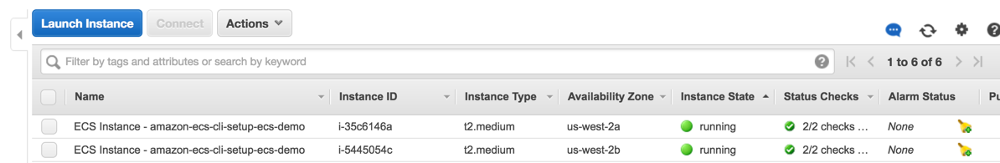

This guide shows you how you can easily deploy Portworx on Amazon Elastic Container Service [**ECS**](https://aws.amazon.com/ecs/)

### Step 1: Download and install the AWS and ECS CLI utilities
We will be creating an ECS cluster using the Amazon ECS and AWS CLI from your workstation.

1. Download and install the AWS CLI by following [these instructions](http://docs.aws.amazon.com/cli/latest/userguide/installing.html)
2. Download and install the ECS CLI by following [these instructions](http://docs.aws.amazon.com/AmazonECS/latest/developerguide/ECS_CLI_installation.html)
3. Obtain your AWS access key ID and secret access key.  Export these environment variables.

```
# export AWS_ACCESS_KEY_ID=XXXXXXXXXXXXXXX
# export AWS_SECRET_ACCESS_KEY=XXXXXXXXXXXXXX
```

### Step 2: Create a keypair to use with this cluster
Create a keypair to use with the cluster that we will create.  Generate SSH keys using `ssh-keygen` and create a AWS keypair.  We will use `id_rsa` as your private key and `portworx` as the keypair for this tutorial.    

```
# ssh-keygen
# ecs-cli configure --region us-west-2 --cluster ecs-demo
# aws ec2 import-key-pair --key-name portworx --public-key-material file://~/.ssh/id_rsa
```

### Step 3: Create an ECS cluster
In this example, we create a 2 node cluster called `ecs-demo` in the US-WEST-2 region.

```
# ecs-cli up --keypair portworx --capability-iam --size 2 --instance-type t2.medium
```

Note that Portworx recommends a minimum cluster size of 3 nodes.

### Step 4: Add storage to the ECS instances
Your ECS instances will appear in your AWS console like this.


You will need to provision storage to these instances by creating new EBS volumes and attaching it to the instances.  Portworx will be using these volumes to provision storage to your containers.

Note that the ECS will create the instances in different availability regions by default.  Therefore, you must first note the instance's regions and then create the corresponding EBS volumes in the same regions.

### Step 5: Configure Docker to allow shared mounts
Log into each of the instances using the key we created in step 2.  Once logged in, we have to configure Docker to allow shared mounts.
For each ECS instance:

```
# ssh -i ~/.ssh/id_rsa ec2-user@35.163.77.134
# mount --make-shared /
# service docker restart
```
Note that this is a temporary workaround until ECS upgrades to Docker 1.12.  As of Docker 1.12, it is no longer required to modify Docker to allow the use of shared mounts.

### Step 6: Deploy Portworx on the ECS instances
Run Portworx on each ECS instance.  Portworx will use the EBS volumes you provisioned in step 4.  You will have to log into each of the ECS instances for this step.

```
# ssh -i ~/.ssh/id_rsa ec2-user@35.163.77.134
# sudo docker run --restart=always --name px -d --net=host \
                 --privileged=true                             \
                 -v /run/docker/plugins:/run/docker/plugins    \
                 -v /var/lib/osd:/var/lib/osd:shared           \
                 -v /dev:/dev                                  \
                 -v /etc/pwx:/etc/pwx                          \
                 -v /opt/pwx/bin:/export_bin:shared            \
                 -v /var/run/docker.sock:/var/run/docker.sock  \
                 -v /var/cores:/var/cores                      \
                 -v /usr/src:/usr/src                          \
                 --ipc=host                                    \
                portworx/px-dev -daemon -k etcd://myetc.company.com:4001 -c MY_CLUSTER_ID -a -z -f
```

### Step 7: Create Portworx volumes and use them with your containers
Create PX volumes using the Docker CLI.  Log into any of the ECS instances and create the PX volumes.

```
# ssh -i ~/.ssh/id_rsa ec2-user@35.163.77.134
# docker volume create -d pxd --name=demovol
demovol

# docker volume ls
DRIVER              VOLUME NAME
pxd                 demovol
```
Note: You can also do this from your workstation by exporting the `DOCKER_HOST` variable to point to any of the ECS instances.  Docker will have to be configured to listen on a TCP port.

Now you can use the `ecs-cli` to create tasks and use the PX volumes.  Launch `redis` with the PX volume from your workstation.

```
# cat redis.yml
web:
  image: binocarlos/moby-counter
  links:
    - redis:redis
redis:
  image: redis
  volumes:
     - ecsvol1:/data
# ecs-cli compose --file redis.yml up 
```
