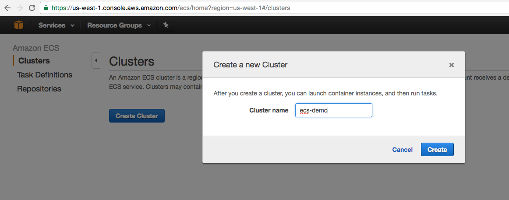
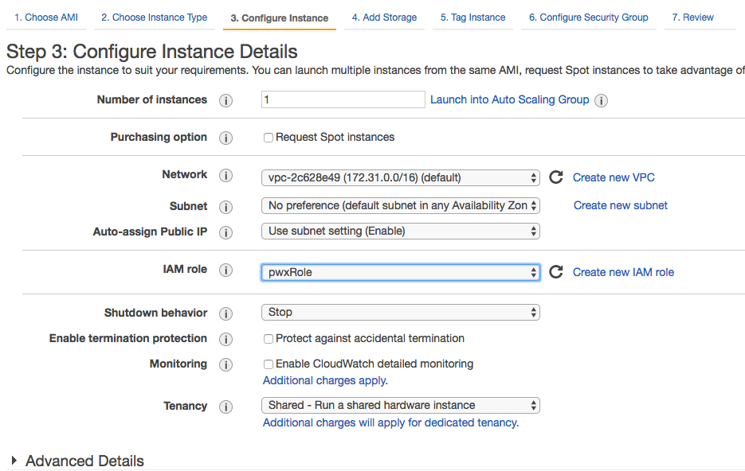
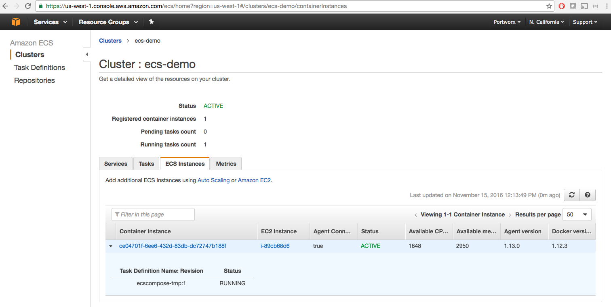
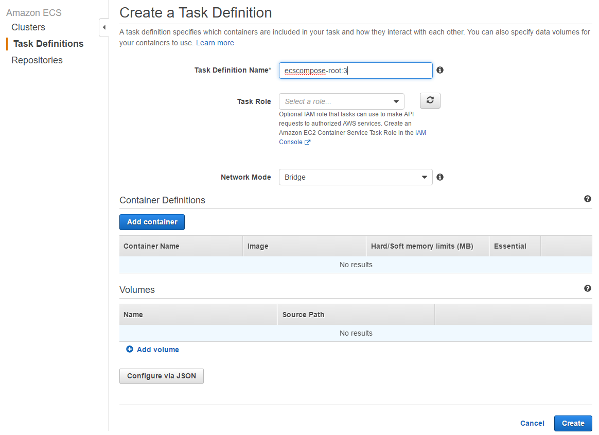
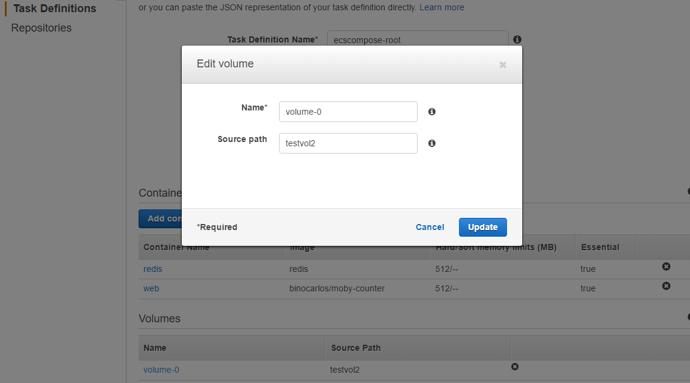
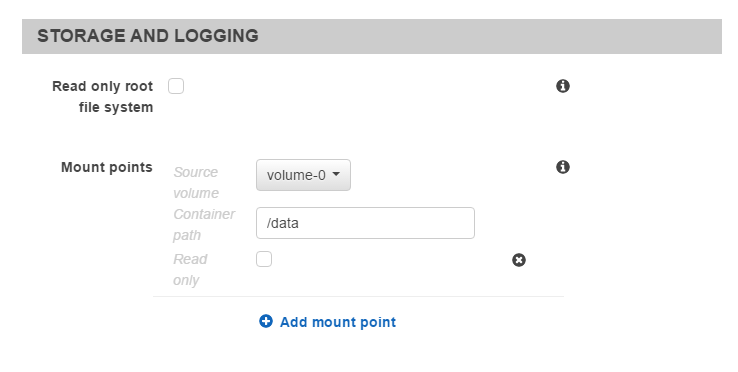

This guide shows you how you can easily deploy Portworx on Amazon Elastic Container Service [**ECS**](https://aws.amazon.com/ecs/)

### Step 1: Create an ECS cluster
In this example, we create an ECS cluster called `ecs-demo` using EC2 instances in the US-WEST-1 region.

We strongly recommend using a Linux AMI with a newer distro compared to the default ECS AMI.  The default ECS AMI uses an older distro and Docker 1.11.

In this example, we created an EC2 instance using the Ubuntu Xenial 16.04 AMI.

Note that Portworx recommends a minimum cluster size of 3 nodes.

#### Create the cluster in the console
Log into the ECS console and create an ecs cluster called "ecs-demo".

.

We will use the name `ecs-demo` to configure your EC2 instances and the `ecs-cli`.

#### Create your EC2 instances
Your EC2 instances must have the correct IAM role set.  Follow these [IAM instructions](http://docs.aws.amazon.com/AmazonECS/latest/developerguide/instance_IAM_role.html).



#### Add storage capacity to each instance
You will need to provision storage to these instances by creating new EBS volumes and attaching it to the instances.  Portworx will be using these volumes to provision storage to your containers.

#### Turn each EC2 instance into an ECS instance
Follow [these](http://docs.aws.amazon.com/AmazonECS/latest/developerguide/ecs-agent-install.html) instructions to install the `ecs-agent` on each EC2 instance to convert it into an ECS instance.

Your command to launch the ecs-agent will look like this:

```
# sudo docker run --name ecs-agent \
		--detach=true \
		--restart=on-failure:10 \
		--volume=/var/run/docker.sock:/var/run/docker.sock \
		--volume=/var/log/ecs/:/log \
		--volume=/var/lib/ecs/data:/data \
		--net=host \
		--env=ECS_LOGFILE=/log/ecs-agent.log \
		--env=ECS_LOGLEVEL=info \
		--env=ECS_DATADIR=/data \
		--env=ECS_CLUSTER=ecs-demo \
		--env=ECS_ENABLE_TASK_IAM_ROLE=true \
		--env=ECS_ENABLE_TASK_IAM_ROLE_NETWORK_HOST=true \
		amazon/amazon-ecs-agent:latest
```

Note the use of the cluster name `ecs-demo` in the `--env=ECS_CLUSTER` environment variable.  Once this has been done, these nodes will now become part of your ECS cluster named `ecs-demo`

### Step 2: Deploy Portworx
Run Portworx on each ECS instance.  Portworx will use the EBS volumes you provisioned in step 4.
You will need the etcd be running, and you can use container for your etcd.

```
docker run -v /data/varlib/etcd -p 4001:4001 -d portworx/etcd:latest

```

You will have to log into each of the ECS instances for this step.

```
# ssh -i ~/.ssh/id_rsa ec2-user@35.163.77.134
# sudo docker run --restart=always --name px -d --net=host \
                 --privileged=true                             \
                 -v /run/docker/plugins:/run/docker/plugins    \
                 -v /var/lib/osd:/var/lib/osd:shared           \
                 -v /dev:/dev                                  \
                 -v /etc/pwx:/etc/pwx                          \
                 -v /opt/pwx/bin:/export_bin:shared            \
                 -v /var/run/docker.sock:/var/run/docker.sock  \
                 -v /var/cores:/var/cores                      \
                 -v /usr/src:/usr/src                          \
                 --ipc=host                                    \
                portworx/px-dev -daemon -k etcd://myetc.company.com:4001 -c MY_CLUSTER_ID -a -z -f
```

### Step 3: Install the ECS CLI
Download and install the ECS CLI utilities on your workstation.  We will be creating an ECS cluster using the Amazon ECS CLI from your workstation.

1. Download and install the ECS CLI by following [these instructions](http://docs.aws.amazon.com/AmazonECS/latest/developerguide/ECS_CLI_installation.html)
2. Obtain your AWS access key ID and secret access key.  Export these environment variables.

```
# export AWS_ACCESS_KEY_ID=XXXXXXXXXXXXXXX
# export AWS_SECRET_ACCESS_KEY=XXXXXXXXXXXXXX
```

Now configure the ecs-cli
```
# ecs-cli configure --region us-west-1 --access-key $AWS_ACCESS_KEY_ID --secret-key $AWS_SECRET_ACCESS_KEY --cluster ecs-demo
```

Note the parameter `--cluster ecs-demo`.  This is what configures your CLI to talk to the ecs cluster named `ecs-demo`.

### Step 4: Test it
Create PX volumes using the Docker CLI.  Log into any of the ECS instances and create the PX volumes.

```
# ssh -i ~/.ssh/id_rsa ec2-user@35.163.77.134
# docker volume create -d pxd --name=demovol
demovol

# docker volume ls
DRIVER              VOLUME NAME
pxd                 demovol
```
Note: You can also do this from your workstation by exporting the `DOCKER_HOST` variable to point to any of the ECS instances.  Docker will have to be configured to listen on a TCP port.

Now you can use the `ecs-cli` to create tasks and use the PX volumes.  Launch `redis` with the PX volume from your workstation.

```
# cat redis.yml
web:
  image: binocarlos/moby-counter
  links:
    - redis:redis
redis:
  image: redis
  volumes:
     - demovol:/data
# ecs-cli compose --file redis.yml up 
```

You can view the task in the ECS console.



#### Creating a task via the console

You can also attach yYou can also create stateful tasks via the ECS console (GUI) and attach Portworx volumes.

Create a new docker volume like we did in step 4.

```
# docker volume create -d pxd --name=testvol2
```

Go to AWS ECS console, On the same cluster "ecs-demo"; create a new task definition.



On the new task definition screen; first add a volume for your container.  Both the name and the source path must be the name of the Portworx volume.


Then add a new container - In the new container configuration page, go to the advanced container configuration.  Under the section of Storage and Logging, define your mount points and the volume path.  Click the drop down selection next to "Mount Points" and choose volume-0. Then enter the path for that mount points, for example `/data`.

