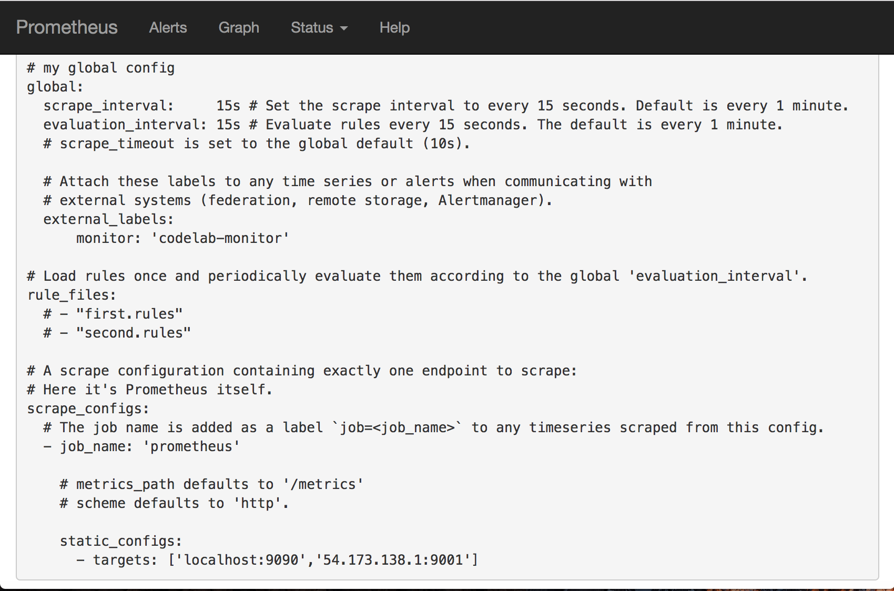
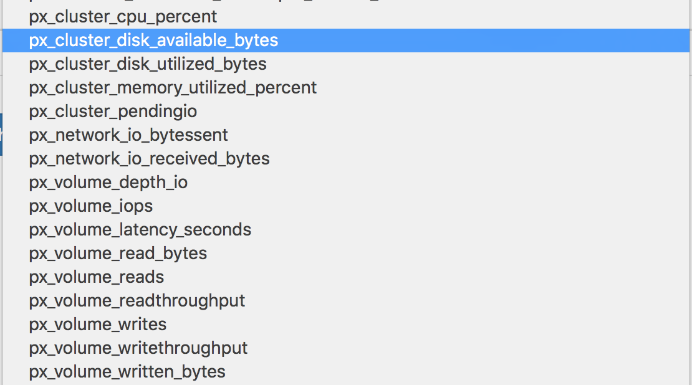
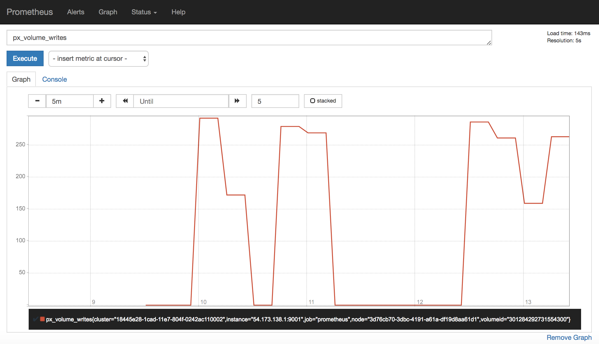
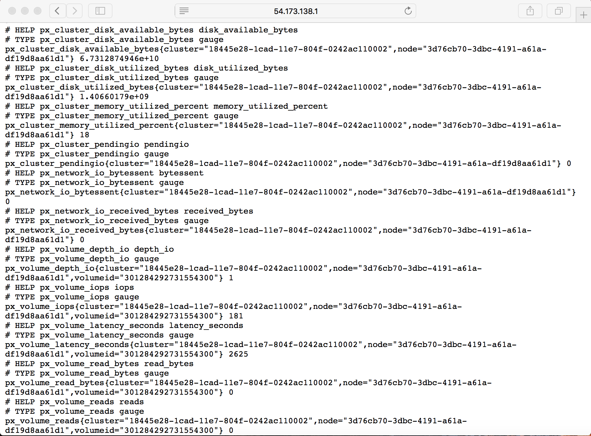

PX storage and network stats can easily be integrated with [**prometheus**](https://prometheus.io) or similar applications.
These stats are exported at port 9001; your application can poll http://<IP_ADDRESS>:9001/metrics to get their runtime values.

## Integration with Prometheus

### Step 1: Configuring Prometheus to watch px node
Add your px node as a target in Prometheus config file:

In the example above, our node has IP address of 54.173.138.1, so Prometheus is watching 54.173.138.1:9001 as its target. This can be any node in the PX cluster.

### Step 2: PX metrics to watch and building graphs with Prometheus

Once Prometheus starts watching px node, you will be able to see new portworx related metrics added to Prometheus. 

You can now build graphs:

**Note**

A curl request on port 9001 also shows the stats:

