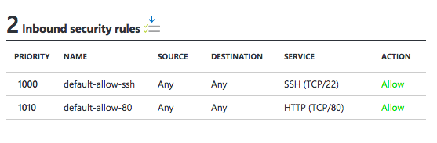

This guide shows you how you can run [PX-Enterprise Console](http://lighthouse.portworx.com/) locally.

Note: The example in this section uses Amazon Web Services (AWS) Elastic Compute Cloud (EC2) for servers in the cluster. In your deployment, you can use physical servers, another public cloud, or virtual machines.

### Step 1: Launch Server

To start, create one server, following these requirements:

* Image: Must support Docker 1.10 or later, such as:
  * [Red Hat 7.2 (HVM)](https://aws.amazon.com/marketplace/pp/B019NS7T5I) or CentOS
  * [Ubuntu 16.04 (HVM)](https://aws.amazon.com/marketplace/pp/B01JBL2M0O)
  * [Ubuntu 14.04 (HVM)](https://aws.amazon.com/marketplace/pp/B00JV9TBA6)
* Instance type: c3.xlarge
* Number of instances: 1
* Storage:
  * /dev/xvda: 8 GB boot device
* Tag (optional): Add value **px-lighthouse** as the name

### Step 2: Install and configure Docker

1. Follow the Docker [install guide](https://docs.docker.com/engine/installation/) to install and start the Docker Service.
2. Verify that your Docker version is 1.10 or later.

### Step 3: Install kvdb


>**Important:**
<br/> For PX-Lighthouse, output required from this step: 
<br/>Connection string in 'etcd:http://{IP_ADDRESS}:2379' or 'consul:http://{IP_Address}:2379' format

* Use your existing kvdb store
* Install as a docker container from the following 
  * [etcd2/etcd3](https://github.com/coreos/etcd/blob/2724c3946eb2f3def5ed38a127be982b62c81779/Documentation/op-guide/container.md)
  
For **ETCD2**, start the container with the following run command:

```
IPADDR=10.1.2.3 
sudo docker run -d -p 4001:4001 -p 2379:2379 -p 2380:2380                     \
     --restart always                                                         \
     --name etcd-px quay.io/coreos/etcd:v2.3.7                                \
     -name etcd0                                                              \
     -data-dir /var/lib/etcd/                                                 \
     -advertise-client-urls http://${IPADDR}:2379,http://${IPADDR}:4001       \
     -listen-client-urls http://0.0.0.0:2379                                  \
     -initial-advertise-peer-urls http://${IPADDR}:2380                       \
     -listen-peer-urls http://0.0.0.0:2380                                    \
     -initial-cluster-token etcd-cluster                                      \
     -initial-cluster etcd0=http://${IPADDR}:2380                             \
     -initial-cluster-state new
```
  
  * [consul](https://hub.docker.com/_/consul/)
  
For **Consul**, start the container with the following run command:

```
sudo docker run -d -p 8300:8300 -p 8500:8500 --restart always  \
     --name consul-px                                          \
     -v /tmp/consul:/consul/data                               \
     consul
```

### Step 4: Install InfluxDB

>**Important:**
<br/> For PX-Lighthouse, output required from this step: 
<br/> Connection string in 'http://{ADMIN_USER}:{ADMIN_PASSWORD}@{IP_Address}:8086' format 
<br/> ADMIN_USER: Admin username of influxdb for $PWX_INFLUXUSR
<br/> INFLUXDB_INIT_PWD: Password of admin user for PWX_INFLUXPW 

* [Use InfluxCloud](https://cloud.influxdata.com/)
* [Run InfluxDB as a docker container](https://github.com/tutumcloud/influxdb)

Example docker command to run influxdb in a contianer:

```
sudo docker run -d -p 8083:8083 -p 8086:8086 --restart always \
     --name influxdb                                          \
     -e ADMIN_USER="admin"                                    \
     -e INFLUXDB_INIT_PWD="password"                          \
     -e PRE_CREATE_DB="px_stats" tutum/influxdb:latest
```

### Step 5: Launch the PX-Lighthouse Container

### Docker compose method

You can run PX-Lighthouse with [docker-compose](https://docs.docker.com/compose/install/), as follows:

```
# git clone https://github.com/portworx/px-lighthouse.git
# cd px-lighthouse/quick-start
# docker-compose run portworx -daemon -k etcd://myetc.company.com:4001 -c MY_CLUSTER_ID -s /dev/nbd1 -s /dev/nbd2
```

### To run the PX-Lighthouse container

For **ETCD**, start the container with the following run command:

```
sudo docker run --restart=always                                        \
       --name px-lighthouse -d --net=bridge                             \
       -p 80:80                                                         \
       portworx/px-lighthouse                                           \
       -d http://{ADMIN_USER}:{ADMIN_PASSWORD}@${IP_ADDR}:8086          \
       -k etcd:http://${IP_ADDR}:2379                
```

For **Consul**, start the container with the following run command:

```
sudo docker run --restart=always --name px-lighthouse -d --net=bridge    \
       -p 80:80                                                          \
       portworx/px-lighthouse                                            \
       -d http://{ADMIN_USER}:{ADMIN_PASSWORD}@${IP_ADDR}:8086           \
       -k consul:http://${IP_ADDR}:8500                
```

Runtime command options

```
-d http://{ADMIN_USER}:{ADMIN_PASSWORD}@{IP_Address}:8086
   > Connection string of your influx db
-k {etcd/consul}:http://{IP_Address}:{Port_NO}
   > Connection string of your kbdb.
   > Note: Specify port 2379 for etcd and 8500 for consul
```

In your browser visit *http://{IP_ADDRESS}:80* to access your locally running PX-Lighthouse.


### Provider Specific Instructions

### Azure

* Make sure you have set inbound security rule to 'Allow' for port 80.



* Start your px-lighthouse container with your private ip address. Access the web console in browser at http://{public-ip-address}:80
