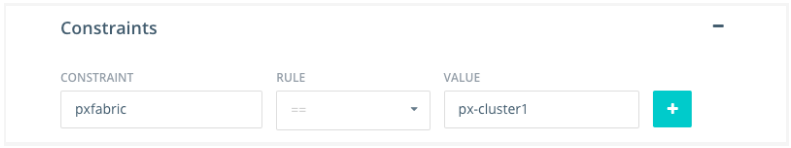

You can use Portworx to implement storage for Docker Universal Control Plane (UCP). 
This section, qualified using Docker 1.11, and Universal Control Plane 1.1.2

Follow the instructions for [Installing Docker UCP](https://docs.docker.com/ucp/installation/install-production)
>**Note:**<br/>You must run Docker Commercially Supported (CS) Engine

After installing Docker UCP, you will need to [license your installation](https://docs.docker.com/ucp/installation/license)

Not all nodes within a UCP cluster will necessarily be running Portworx.   In order for UCP to properly identify Portworx nodes, the Docker Daemon must start with a Label that indicates Portworx is running.

For Docker 1.11 
First you will need to update the docker.service file run the systemctl command to find where your docker.service file is located:
```
[...]
systemctl status docker
[...]

```
Replace the existing ExecStart line with the one below
```
[...]
ExecStart=/usr/bin/docker daemon -H fd:// --label pxfabric=px-cluster1
[...]


```
Then you will need to reload systemctl and restart the docker daemon:

```
# systemctl daemon-reload
# systemctl restart docker
```


Afterwards, you should be able to verify that the label is in place for whichever nodes are running PX:

```
# docker info
[...]
Labels:
    pxfabric=px-cluster1
[...]
```


>**Note:**<br/>You can use the fabric label to specify different PX-clusters


To launch a container from the command line and restrict it to running on a node that is running Portworx:

```
docker  run -d -P -e constraint:pxfabric==px-cluster1 --name db mysql
```


Or on the UCP GUI for launching a contaner:


Addition information on Docker Filters and Constraints can be found [here](https://docs.docker.com/swarm/scheduler/filter/)

Docker 1.12

Follow the instructions for [Installing Docker UCP](https://docs.docker.com/ucp/installation/install-production)
>**Note:**<br/>You must run Docker Commercially Supported (CS) Engine

After installing Docker UCP, you will need to [license your installation](https://docs.docker.com/ucp/installation/license)

Not all nodes within a UCP cluster will necessarily be running Portworx.   In order for UCP to properly identify Portworx nodes, the Docker Daemon must start with a Label that indicates Portworx is running.


First you will need to update the docker.service file run the systemctl command to find where your docker.service file is located:
```
[...]
systemctl status docker
[...]

```
Replace the existing ExecStart line with the one below


```
[...]
ExecStart=/usr/bin/docker --label pxfabric=px-cluster1
[...]


```
Then you will need to reload systemctl and restart the docker daemon:

```
# systemctl daemon-reload
# systemctl restart docker
```


Afterwards, you should be able to verify that the label is in place for whichever nodes are running PX:

```
# docker info
[...]
Labels:
    pxfabric=px-cluster1
[...]
```


>**Note:**<br/>You can use the fabric label to specify different PX-clusters


To launch a container from the command line and restrict it to running on a node that is running Portworx:

```
docker  run -d -P -e constraint:pxfabric==px-cluster1 --name db mysql
```


Or on the UCP GUI for launching a contaner:


Addition information on Docker Filters and Constraints can be found [here](https://docs.docker.com/swarm/scheduler/filter/)
