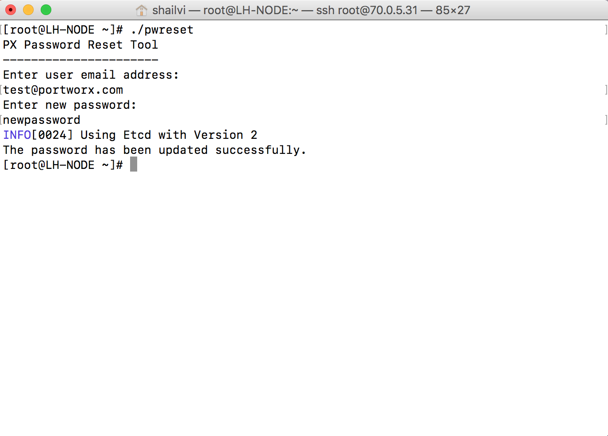

### Steps to update Lighthouse user password from CLI

**Make executable of the Lighthouse password reset binary given to you**
```
chmod +x pwreset
```

**Export kvdb environment variables that you had used while running lighthouse container**

e.g. export PWX_KVDB=etcd:http://${LOCAL_IP}:2379

The following environment variables are available for px-lighthouse:

```
PWX_KVDB                    KVDB URL:PORT without username:password
PWX_KVDB_AUTH               'true' or 'false', to enable or disable auth 
PWX_KVDB_CA_PATH            Absolute path to host ca cert(e.g. /etc/ssl/ca.crt)
PWX_KVDB_USER_CERT_KEY_PATH Absolute path to host's certificate file (e.g. /etc/ssl/key.cert)
PWX_KVDB_USER_CERT_PATH     Absolute path to host's private key (e.g. /etc/ssl/key.key)
PWX_KVDB_USER_PWD           Username and password for etcd2 as username:password

(Note: If you are specifying PWX_KVDB_USER_PWD, then PWX_KVDB_AUTH needs to be set as true)
```

**Run the binary**

```
./pwreset 
```


